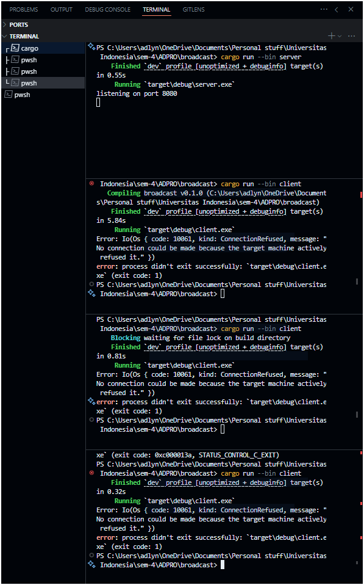
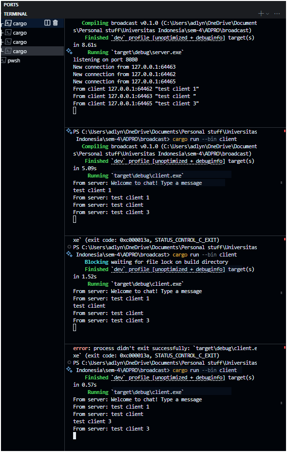
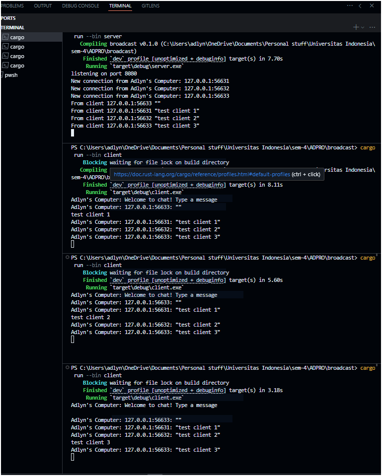

# Module 10 - Broadcast Chat Application


## How to Run the Application
### Running the Server
Open a terminal and run:
```bash
cargo run --bin server
```
The server will start listening on port 8080. You should see:
```
listening on port 8080
```

### Running the Clients
Open three separate terminal windows and run in each:
```bash
cargo run --bin client
```
You'll see a "Welcome to chat!" message when connected successfully.

## What Happens When You Type Messages

1. When any client types a message and presses Enter:
   - The message is sent to the server
   - The server broadcasts the message to all connected clients
   - All clients (including the sender) receive the message prefixed with "From server:"

2. Example scenario:
   - Client 1 types "Hello everyone!"
   - All three clients will see: "From server: Hello everyone!"
   - Client 2 types "Hi there!"
   - All three clients will see: "From server: Hi there!"

## Port Configuration Testing

When testing different port configurations, I observed the following:

1. Default Configuration:
   - Server listens on port 8080
   - Client connects to ws://127.0.0.1:8080
   - Connection works successfully

2. Mismatched Ports:

   - When the client attempts to connect to port 7000 while the server runs on 8080
   - Results in ConnectionRefused errors
   - Client repeatedly tries and fails to establish connection

3. Successful Connection:

   - After updating client port to match server (8080)
   - Connection establishes successfully
   - WebSocket upgrade occurs properly from TCP connection

Note: The server accepts TCP connections initially and upgrades them to WebSocket connections, while the client connects directly using the WebSocket protocol.

## Client Identification


Messages in the chat now display sender identification by showing the client's address and port. This enhancement was implemented through a simple modification in the server's broadcast functionality:

```rust
// Before: bcast_tx.send(text.into())?;
// After: bcast_tx.send(format!("{}: {}", addr, text))?;
```

This change ensures each message is prefixed with the sender's address, making it easy to identify who sent which message in the conversation.