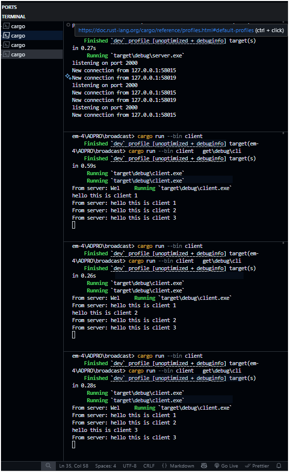

# Module 10 - Broadcast Chat Application



## How to Run the Application
### Running the Server
Open a terminal and run:
```bash
cargo run --bin server
```
The server will start listening on port 2000. You should see:
```
listening on port 2000
```

### Running the Clients
Open three separate terminal windows and run in each:
```bash
cargo run --bin client
```
You'll see a "Welcome to chat!" message when connected successfully.

## What Happens When You Type Messages

1. When any client types a message and presses Enter:
   - The message is sent to the server
   - The server broadcasts the message to all connected clients
   - All clients (including the sender) receive the message prefixed with "From server:"

2. Example scenario:
   - Client 1 types "Hello everyone!"
   - All three clients will see: "From server: Hello everyone!"
   - Client 2 types "Hi there!"
   - All three clients will see: "From server: Hi there!"